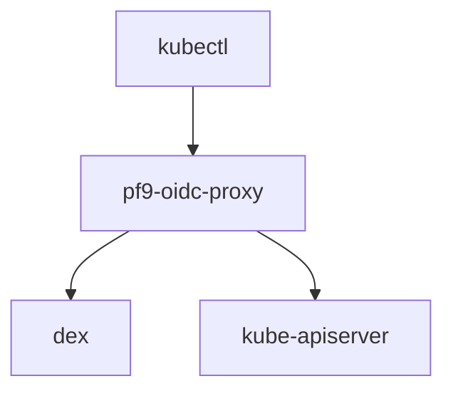

# pf9-oidc-proxy

`pf9-oidc-proxy` is a proof of concept for Kubernetes authentication using OIDC for the
`kaapi` use case. The code for the changes are in `pf9-oidc` branch.

At the heart it is `kube-oidc-proxy`, a reverse proxy server to authenticate users using OIDC and forward requests to the Kubernetes API server by impersonating the authenticated user.

The `pf9` part of it is a simple fix that `overrides` the namespace with the configured namespace.

Here is the POC that I tested.



## Changes the the configuration
A new parameter called 'namespace-override' was added that would change the namespace in the request 
from
`https://kube-api-svc/api/v1/namesapaces/{namespace}/pods` to
`https://kube-api-svc/api/v1/namespaces/{namespace-override}/pods`

## Demo Configuration

Running the proxy `pf9-oidc-proxy` commandline:

```bash
./pf9-oidc-proxy/bin/kube-oidc-proxy \
--oidc-issuer-url=https://localhost:5554/dex \
--oidc-client-id=kubernetes \
--oidc-username-claim=email \
--oidc-groups-claim=groups \
--secure-port=8443 \
--kubeconfig=./k3s.yaml \
--ns-mapping-file=/home/rparikh.linux/oidc/suffix-ns-mapping.json \
--oidc-ca-file=/home/rparikh.linux/oidc/ca.crt \
--tls-cert-file=/home/rparikh.linux/oidc/server.crt \
--tls-private-key-file=/home/rparikh.linux/oidc/server.key \
--insecure-skip-tls-verify \
--v=4

```

__The Suffix Mapping file__

```json
{
        "tenant1":"n1",
        "tenant2":"n2",
        "admintenant":"kube-system"
}
```
__The Dex configuration__

```yaml
issuer: https://localhost:5554/dex
storage:
  type: memory

web:
  https: 127.0.0.1:5554
  tlsCert: /home/rparikh.linux/oidc/server.crt
  tlsKey: /home/rparikh.linux/oidc/server.key
# Configuration for telemetry
telemetry:
  http: 0.0.0.0:5558
# If this option isn't chosen clients may be added through the gRPC API.
staticClients:
- id: kubernetes
  redirectURIs:
  - 'http://localhost:18000'
  name: 'kubernetes'
  secret: kubernetessecret
  scopes:
  - openid
  - profile
  - email
  - groups
connectors:
- type: mockCallback
  id: mock
  name: kubernetes
enablePasswordDB: true
# The group configuration with staticPasswords doesn't work
staticPasswords:
- email: "admin@example.com"
  # bcrypt hash of the string "password": $(echo password | htpasswd -BinC 10 admin | cut -d: -f2)
  hash: "$2a$10$2b2cU8CPhOTaGrs1HRQuAueS7JTT5ZHsHSzYiFPm1leZck7Mc8T4W"
  username: "admin"
  userID: "admin"
- email: "admin1@example.com"
  # bcrypt hash of the string "password": $(echo password | htpasswd -BinC 10 admin | cut -d: -f2)
  hash: "$2a$10$2b2cU8CPhOTaGrs1HRQuAueS7JTT5ZHsHSzYiFPm1leZck7Mc8T4W"
  username: "admin1"
  userID: "admin1"
```

__Start Dex__

```bash
 ./dex/bin/dex serve ./dex.yaml
```

__Role and RoleBinding__

```yaml
apiVersion: rbac.authorization.k8s.io/v1
kind: Role
metadata:
  namespace: n1
  name: n1-role
rules:
- apiGroups: [""]
  resources: ["pods", "services", "configmaps"]
  verbs: ["get", "list", "watch"]
---
apiVersion: rbac.authorization.k8s.io/v1
kind: RoleBinding
metadata:
  namespace: n1
  name: n1-bindings
subjects:
- kind: User
  name: admin@example.com  # This matches the group assigned to alice in Dex
  apiGroup: rbac.authorization.k8s.io
roleRef:
  kind: Role
  name: n1-role
  apiGroup: rbac.authorization.k8s.io
  ```

  __Kubeconfig__

  ```yaml
  apiVersion: v1
kind: Config
preferences: {}

# Cluster information
clusters:
- name: my-cluster
  cluster:
    server: https://localhost:8443/tenant1/
    certificate-authority-data: LS0tLS1CRUdJTiBDRVJUSUZJQ0FURS0tLS0tCk1JSUZqekNDQTNlZ0F3SUJBZ0lVV3JGa0ZoeGJ6M2FSNFArcHRkLy9pMjhmNDBrd0RRWUpLb1pJaHZjTkFRRUwKQlFBd1Z6RUxNQWtHQTFVRUJoTUNWVk14Q3pBSkJnTlZCQWdNQWtOQk1Rd3dDZ1lEVlFRSERBTlRTa014RERBSwpCZ05WQkFvTUExQkdPVEVMTUFrR0ExVUVDd3dDUlVReEVqQVFCZ05WQkFNTUNXeHZZMkZzYUc5emREQWVGdzB5Ck5ERXhNamd3TXpBek16RmFGdzB6TkRFeE1qWXdNekF6TXpGYU1GY3hDekFKQmdOVkJBWVRBbFZUTVFzd0NRWUQKVlFRSURBSkRRVEVNTUFvR0ExVUVCd3dEVTBwRE1Rd3dDZ1lEVlFRS0RBTlFSamt4Q3pBSkJnTlZCQXNNQWtWRQpNUkl3RUFZRFZRUUREQWxzYjJOaGJHaHZjM1F3Z2dJaU1BMEdDU3FHU0liM0RRRUJBUVVBQTRJQ0R3QXdnZ0lLCkFvSUNBUURLd2NHRks2dVlWczRncjUyZ3hHOW5XODA3NUkremJ0M1Z6dU94aVgveGZQV0Y3ZjE1ZkdpWUxuZmsKZncva05JQnRycDFvOFdOSGZzczQ4MEp1eUpnNzFLQWRZZUpzcGUrbVpBMThrWTV4dVhkcmFHR251eVBtOUJhcApiSnk4TjZ6OHhseGZ6ZDRWb1dydjh6SnBYcVUyc0ZzL2pIeHJZWEpMZlAyS0pGcXAyL2lrbDRFY0tiUGtSVjNFClQwUmc4OHU1SmdvK0o2aHQwcEs2ZVpoaFhPT21uWjA2VXh2bmZLaGZaZ3ZSNjE2TkdONi9VcHphdzhQMGJZRUQKeitaeDNHNWthL1R1U1o1T2J4Z3RmMWc0dWxZRThmOXBGamxFU2tUWlBMLytoUEpVQS9POXZsdUdZMmlaZ3FwTwprWlEvVENGbDQwZmhEOHMya3VuR2g4MzJ0dXBvWEhMSnBMckxmNEVqOFlycE5xNzY5QldTSDFIK0RqRlhsZTVNCjhsZFFZakRBcE9ZZzNBVHpuQjVVN2kwQ05WWDhBaVZHdDRMQXNRWWRxbW1mYjYvWkh2N3dxMmFVblhrSVNXRzEKc1JUdXJvSzlZZUp3ZU1VL0JSRE9EMkxZaEFtWjV2ZDhNTTVDYmwxUStpU0xRRWtyRGM3OVhrckp2ZFZEZVRrUgp3TDhORUhKYTVNb3RYVHZKZXk4b0xlV3U4TlRMOVR5UEhpV28rdkk1SWV2QlczeGMxcVZRZTY1ZGNmWFQ0cVpqCnlvZ2x6VUZBRHRkLzgvR0F2UU1UR1JjNXh1dW5YUXRRRVlqdkNnWU4wODd5MStDODlkT0dLcTNFSXdxQ0drUGUKeDltMjNnUGhVU0FJNVFZREpZQzZDdzEyUUp5REcybklQT0FWOTk5VEdNMzVyaGR5MndJREFRQUJvMU13VVRBZApCZ05WSFE0RUZnUVVrVGZzcU5mNnpxcGU2blp2UFJTSk1HK0lCV0V3SHdZRFZSMGpCQmd3Rm9BVWtUZnNxTmY2CnpxcGU2blp2UFJTSk1HK0lCV0V3RHdZRFZSMFRBUUgvQkFVd0F3RUIvekFOQmdrcWhraUc5dzBCQVFzRkFBT0MKQWdFQUpwcUVjMU1VNHNoYjlXTDFKU1dQM3FpdjBrclNwMmg2MThBWTdwK2RpTzZpQjJyL3B4QzUzUkQ5WU41MQpkTm1ZVjdJeHFtMUNNME1kaHVERkRCSDQ5djhqV1Q5ZHFnSjFYZWIrQ3dZWGJXWTJnT3FncVFLdFRLaVlnWWc3Cjd6WjFYWGJ3dkc4MUs2RjVqS0VLR2F5aVVuekpvMi9OejEvaFBRdW1yNDRGdWloMFJEaUY5MVU5YzU5WThqdG4KQXRjMmtmbytKZkNZMERCMkZkcjZ0eEhraE9vSytHRDU5ZFR1c1JqOWprTTJCOFlFVjdSb3F0QUFJVVFPYUR1VgpvNTdOdFdXa2VYdzMyZDY0ODVYK215a2NLZUNialdHejdnQVgyQ1dBd0VxOHRFNGk5cUk5L0R6cW1od1R6Ym9BCnFtdHZDWG9QOXBRWDd6dUp0b3hNZVhRdHI1STBydFNrTG5hd1RCajZCNjZ0STk4UEJ4cThvUlpBU0tnbnVoN00KTFk4MmRkYnV1MjFIZ1hiSVU1TkJxVTR4VGFxdXpHQnRtL3FrUlFXVFR1TFlnQmk1elhPYXZCbUE4VjFQc2QxNQpJQ3pFMGtBV0xLRkYwUjdsSE9GY2gvc09iV2dZV1JHcUUzWFRtb3FmOFBhTlhHQ3dzZGlyc3FKTXRzaHhxeFVjCkFYRk54U3dYakQvYWVBUUd6WTZxTUNKWmJTR2ZoYU1TWkd1NVlsblpDMENXdkhsd3puQkZscmc4S1d2ZU1YQmQKM0ptRlAzNG5Ud2xvWE5hYWxXK1ZKUm1DVU9QR2g1WGd6T3hkZkJ4MDdlc2FlZzhPZGNUN3JRUnZBdkxaN0tEWQowTnpvOHJqeEIwNU92eUhHaFJHTnFsaGtEYjR0TGk5OHpmY3VCQVhGRDU4WnhIOD0KLS0tLS1FTkQgQ0VSVElGSUNBVEUtLS0tLQo= 

# User with OIDC authentication
users:
- name: oidc-user
  user:
    exec:
      apiVersion: client.authentication.k8s.io/v1beta1
      command: kubectl
      args:
      - oidc-login
      - get-token
      - --oidc-issuer-url=https://localhost:5554/dex
      - --oidc-client-id=kubernetes
      - --oidc-client-secret=kubernetessecret
      - --certificate-authority=/Users/rparikh/work/kappuccino/ca.crt
      - --oidc-extra-scope=groups,email,profile

# Context linking cluster and user
contexts:
- name: oidc-context
  context:
    cluster: my-cluster
    user: oidc-user

# Set the current context
current-context: oidc-context

  ```
# kube-oidc-proxy

`kube-oidc-proxy` is a reverse proxy server to authenticate users using OIDC to
Kubernetes API servers where OIDC authentication is not available (i.e. managed 
Kubernetes providers such as GKE, EKS, etc).

This intermediary server takes `kubectl` requests, authenticates the request using
the configured OIDC Kubernetes authenticator, then attaches impersonation
headers based on the OIDC response from the configured provider. This
impersonated request is then sent to the API server on behalf of the user and
it's response passed back. The server has flag parity with secure serving and
OIDC authentication that are available with the Kubernetes API server as well as
client flags provided by kubectl. In-cluster client authentication is also
available when running `kube-oidc-proxy` as a pod.

Since the proxy server utilises impersonation to forward requests to the API
server once authenticated, impersonation is disabled for user requests to the
API server.


The following is a diagram of the request flow for a user request.


## Quickest Start

OpenUnison integrates kube-oidc-proxy directly, and includes an identity provider and access portal for Kubernetes.  The quickest way to get started with kube-oidc-proxy is to follow the directions for OpenUnison's deployment at https://openunison.github.io/.

## Tutorial

Directions on how to deploy OIDC authentication with multi-cluster can be found
[here.](./demo/README.md) or there is a [helm chart](./deploy/charts/kube-oidc-proxy/README.md).

### Quickstart

Deployment yamls can be found in `./deploy/yaml` and will require configuration to
an exiting OIDC issuer.

This quickstart demo will assume you have a Kubernetes cluster without OIDC
authentication, as well as an OIDC client created with your chosen
provider. We will be using a Service with type `LoadBalancer` to expose it to
the outside world. This can be changed depending on what is available and what
suites your set up best.

Firstly deploy `kube-oidc-proxy` and it's related resources into your cluster.
This will create it's Deployment, Service Account and required permissions into
the newly created `kube-oidc-proxy` Namespace.

```
$ kubectl apply -f ./deploy/yaml/kube-oidc-proxy.yaml
$ kubectl get all --namespace kube-oidc-proxy
```

This deployment will fail until we create the required secrets. Notice we have
also not provided any client flags as we are using the in-cluster config with
it's Service Account.

We now wait until we have an external IP address provisioned.

```
$ kubectl get service --namespace kube-oidc-proxy
```

We need to generate certificates for `kube-oidc-proxy` to securely serve.  These
certificates can be generated through `cert-manager`, more information about
this project found [here](https://github.com/jetstack/cert-manager).

Next, populate the OIDC authenticator Secret using the secrets given to you
by your OIDC provider in `./deploy/yaml/secrets.yaml`. The OIDC provider CA will be
different depending on which provider you are using. The easiest way to obtain
the correct certificate bundle is often by opening the providers URL into a
browser and fetching them there (typically output by clicking the lock icon on
your address bar). Google's OIDC provider for example requires CAs from both
`https://accounts.google.com/.well-known/openid-configuration` and
`https://www.googleapis.com/oauth2/v3/certs`.


Apply the secret manifests.

```
kubectl apply -f ./deploy/yaml/secrets.yaml
```

You can restart the `kube-oidc-proxy` pod to use these new secrets
now they are available.

```
kubectl delete pod --namespace kube-oidc-proxy kube-oidc-proxy-*
```

Finally, create a Kubeconfig to point to `kube-oidc-proxy` and set up your OIDC
authenticated Kubernetes user.

```
apiVersion: v1
clusters:
- cluster:
    certificate-authority: *
    server: https://[url|ip:443]
  name: *
contexts:
- context:
    cluster: *
    user: *
  name: *
kind: Config
preferences: {}
users:
- name: *
  user:
    auth-provider:
      config:
        client-id: *
        client-secret: *
        id-token: *
        idp-issuer-url: *
        refresh-token: *
      name: oidc
```

## Configuration
 - [Token Passthrough](./docs/tasks/token-passthrough.md)
 - [No Impersonation](./docs/tasks/no-impersonation.md)
 - [Extra Impersonations Headers](./docs/tasks/extra-impersonation-headers.md)
 - [Auditing](./docs/tasks/auditing.md)

## Logging

In addition to auditing, kube-oidc-proxy logs all requests to standard out so the requests can be captured by a common Security Information and Event Management (SIEM) system.  SIEMs will typically import logs directly from containers via tools like fluentd.  This logging is also useful in debugging.  An example successful event:

```
[2021-11-25T01:05:17+0000] AuSuccess src:[10.42.0.5 / 10.42.1.3, 10.42.0.5] URI:/api/v1/namespaces/openunison/pods?limit=500 inbound:[mlbadmin1 / system:masters|system:authenticated /]
```

The first block, between `[]` is an ISO-8601 timestamp.  The next text, `AuSuccess`, indicates that authentication was successful.  the `src` block containers the remote address of the request, followed by the value of the `X-Forwarded-For` HTTP header if provided.  The `URI` is the URL path of the request.  The `inbound` section provides the user name, groups, and extra-info provided to the proxy from the JWT.

When there's an error or failure:

```
[2021-11-25T01:05:24+0000] AuFail src:[10.42.0.5 / 10.42.1.3] URI:/api/v1/nodes
```

This is similar to success, but without the token information.

## End-User Impersonation

kube-oidc-proxy supports the impersonation headers for inbound requests.  This allowes the proxy to support `kubectl --as`.  When impersonation headers are included in a request, the proxy checks that the authenticated user is able to assume the identity of the impersonation headers by submitting `SubjectAccessReview` requests to the API server.  Once authorized, the proxy will send those identity headers instead of headers generated for the authenticated user.  In addition, three `Extra` impersonation headers are sent to the API server to identify the authenticated user who's making the request:

| Header | Description |
| ------ | ----------- |
| `originaluser.jetstack.io-user` | The original username |
| `originaluser.jetstack.io-groups` | The original groups |
| `originaluser.jetstack.io-extra` | A JSON encoded map of arrays representing all of the `extra` headers included in the original identity |

In addition to sending this `extra` information, the proxy adds an additional section to the logfile that will identify outbound identity data.  When impersonation headers are present, the `AuSuccess` log will look like:

```
[2021-11-25T01:05:17+0000] AuSuccess src:[10.42.0.5 / 10.42.1.3] URI:/api/v1/namespaces/openunison/pods?limit=500 inbound:[mlbadmin1 / system:masters|system:authenticated /] outbound:[mlbadmin2 / group2|system:authenticated /]
```

When using `Impersonate-Extra-` headers, the proxy's `ServiceAccount` must be explicitly authorized via RBAC to impersonate whatever the extra key is named.  This is because extras are treated as subresources which must be explicitly authorized.  


## Development
*NOTE*: building kube-oidc-proxy requires Go version 1.17 or higher.

To help with development, there is a suite of tools you can use to deploy a
functioning proxy from source locally. You can read more
[here](./docs/tasks/development-testing.md).
